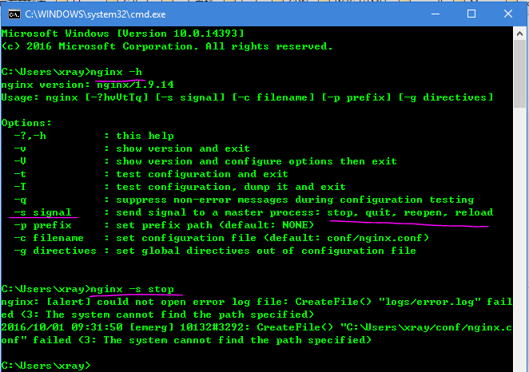
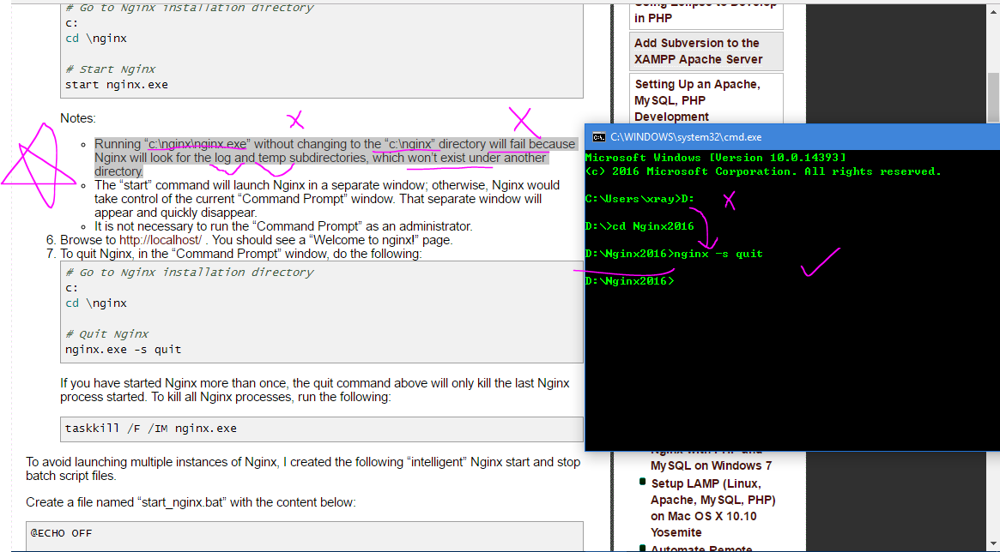

# Nginx
Nginx for windows10 &amp;&amp; PHP7 &amp;&amp; Mysql 

## [nginx for Windows](http://nginx.org/en/docs/windows.html)

```sh
# nginx/Windows runs as a standard console application (not a service), 
# and it can be managed using the following commands:

$ nginx -s stop	
# fast shutdown

$ nginx -s quit	
# graceful shutdown

$ nginx -s reload	
# changing configuration, starting new worker processes with a new configuration,
# graceful shutdown of old worker processes

$ nginx -s reopen	
# re-opening log files
```



## [Nginx with PHP and MySQL on Windows 7](http://www.chanhvuong.com/2809/nginx-with-php-and-mysql-on-windows-7/)  

### CMD 启动 Nginx
> 1. 在Nginx 的安装目录下
> 2. 带.exe扩展名
```sh
start nginx.exe 
```
### CMD 启动 Nginx
> 1. 任意目录下
> 2. 带 -s 参数列表值
```sh
nginx -s stop/quit/reopen/reload 
```

```sh
# To run the Nginx web server, launch the “Command Prompt” and issue these commands:
# Go to Nginx installation directory
c:\>cd \nginx

# Start Nginx 
c:\nginx>start nginx.exe
# c:\nginx>nginx -s stop/quit/reopen/reload 
# Notes:

# Running “c:\nginx\nginx.exe” without changing to the “c:\nginx” directory will fail，
# because Nginx will look for the log and temp subdirectories, which won’t exist under another directory.
# The “start” command will launch Nginx in a separate window;
# otherwise, Nginx would take control of the current “Command Prompt” window. 
# That separate window will appear and quickly disappear.
# It is not necessary to run the “Command Prompt” as an administrator.
```

